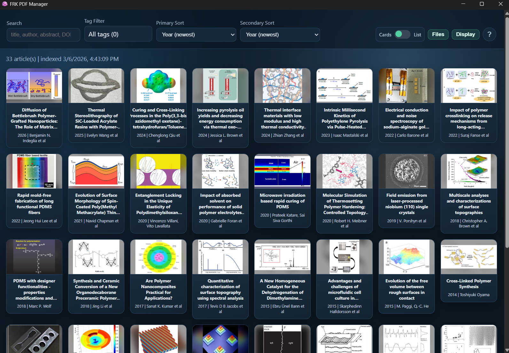
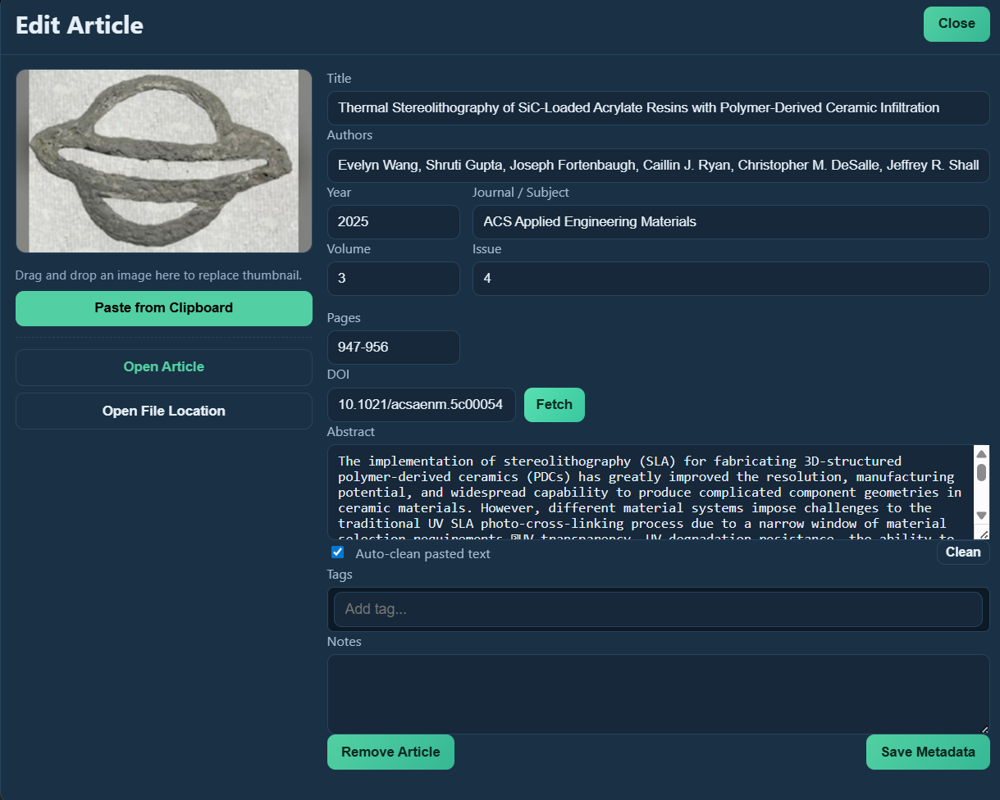
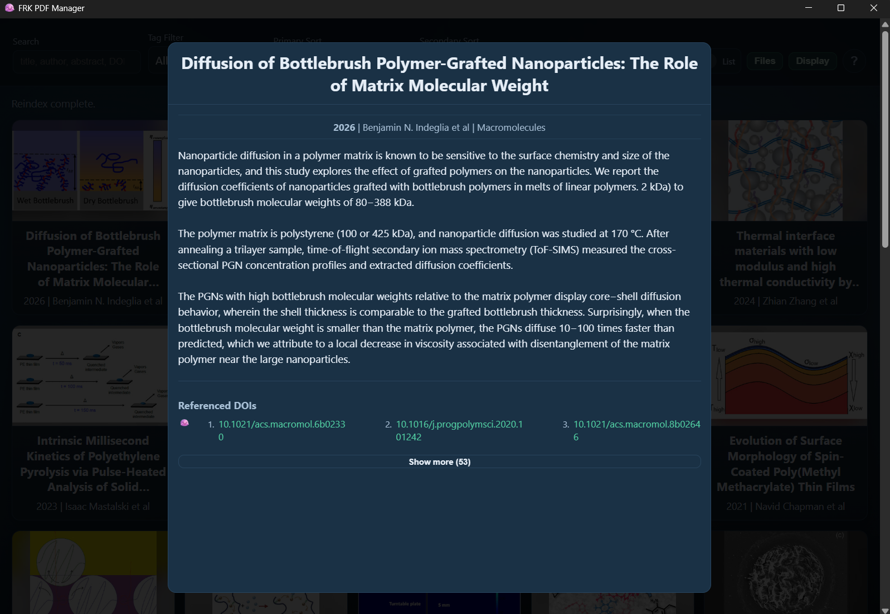
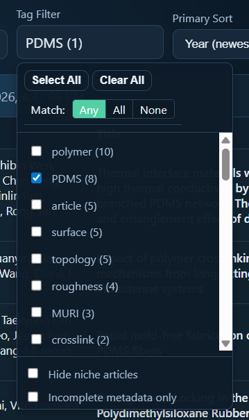
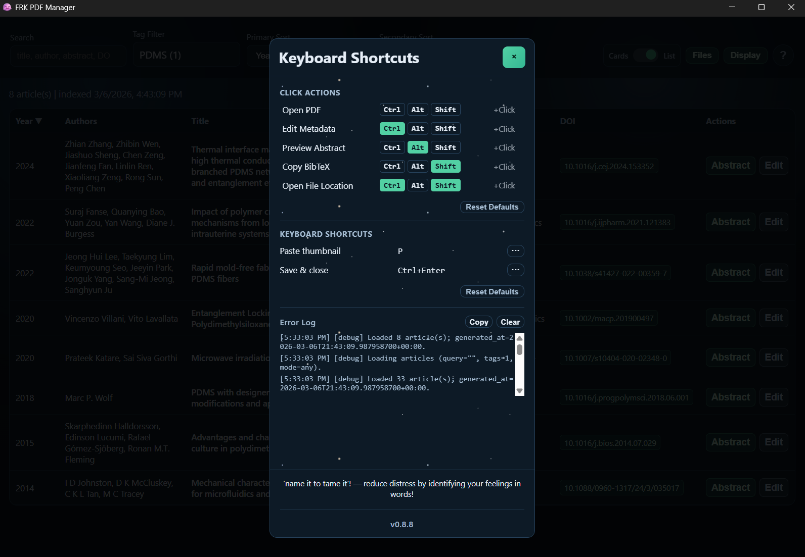
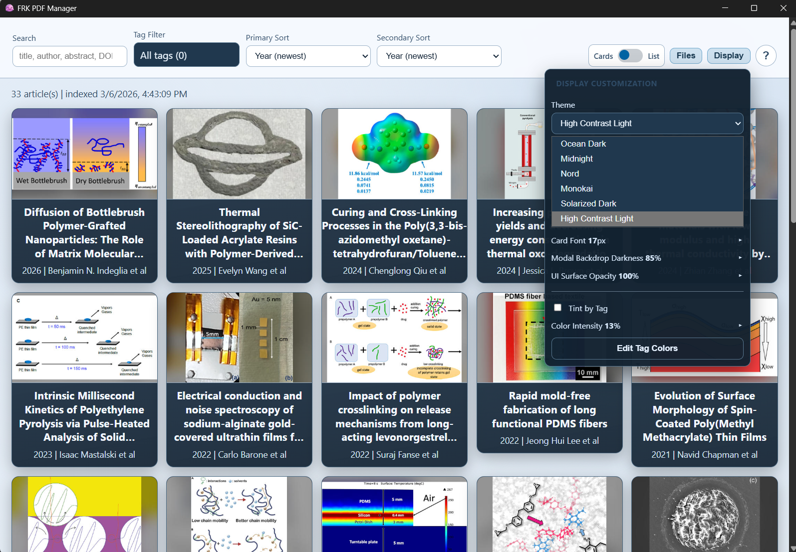

# Literature Library

Windows application for browsing local PDFs, geared towards collections of scientific literature.


The PDFs still open in the default viewer, but the browser facilitates searches with visual thumbnail cards with various customizations.  There are also tags/filters with custom colorization and search functions, fields for note-taking, abstract previews, and hotkeys for tedious tasks, like BibTex-to-clipboard.

## Front Page

Drag-and-drop PDFs onto the open application window to copy into the `Articles/` folder at the project root and display them as cards in the application.



- primary and secondary sort based on article content (title, publication date, etc.) or metadata (recently added, last opened, etc.)

- toggle between the visual 'cards' UI or or the traditional simplified 'list' view.

---

## Metadata Editor

Unfortunately, fully-automated parsing from PDFs of bulk collections of journal articles is unreliable for even standard metadata, much less the extraction and sizing of thumbnail images.  While some manual effort is necessary, the metadata editor here attempts to streamline the finding, managing, and editing of metadata and thumbnail images for added PDFs.



- use 'fetch' to automatically parse PDF for DOI and fill metadata found on API request

  - my experience suggests a reliability of about 9 of 10 'modern' articles and perhaps 3 of 10 'dated' articles

  - Crossref API requires internet connection

- abstracts are often excluded from the API extraction, but the artifacts often associated with copying PDF content are addressed through some scripting through both heuristic and NLP solutions (see abstract preview below)

- take a custom thumbnail with Windows snip tool (`Windows + Shift + S`) and click "Paste from Clipboard" (*default hotkey `P`*)

- 'tags' are entered and managed as chips with tab-autocompletion

---

## Abstract Preview

Abstract text added to the metadata modal, whether parsed from PDF or manually pasted, is automatically processed and segmented to a more digestable view here.  This is intended to be paired with the `view abstract preview` hotkey to streamline scanning of articles' tenor across a library.



- if abstract is formatted undesirably, try playing with the `abstract partitioning strength` slider in the `Files` menu and the `Clean` button in the metadata modal

- if metadata was 'fetched' in the metadata modal, hyperlinked reference DOIs automatically populate here

---

## Tags and Filters

Similarly, the article tags from the metadata modal can be filtered to view project-, concept-, or technique-specific collections.



- select from tags assigned to articles in their metadata modal

- chips components offer tab auto-completion for existing tags

- choose filter mode (show matches with 'any', 'all', or 'none' of the selected tags)

- for searches and filters to be effective, metadata and tag assignment should be meticulous, which can be difficult keep up with.  However, the 'Incomplete metadata only' option in the filter menu is meant to help identify articles which require this attention

---

## Shortcuts

Customize various mouse/keyboard hotkeys to, for instance, open the article location in the file system, or copy BibTeX citation to the clipboard.
  


- click event modifiers on article cards

  - open the article in the default PDF viewer

  - open the metadata editor modal

  - open the abstract modal

  - open the article file location on device

  - copy the BibTeX-formatted citation information to the clipboard (LaTeX bibliography file formatting)

- keyboard events

  - paste thumbnail from clipboard (while anywhere in the metadata modal OR to the card under the cursor in the card view)

  - save and exit metadata modal

  - move between articles or modals

---

## Display, Themes, and Color Filters

Various color themes and low-light environment filters are available, as well as the option to customize the color of articles based on their tags (e.g., personal projects are tinted teal and collaborations are tinted orange).



- display settings unrelated to color theme are also available in the display menu

  - font

  - card size

  - modal opacity

  - modal focus (background darkening)

- to mitigate eye strain in low-light environments, try adjusting filters and filter strength found in `filter modes`

---

# Installation

Download the latest installer on the GitHub repo releases page [here](https://github.com/frkatona/journal-article-library-webGUI/releases)

# Development details

Built with [Tauri v2](https://tauri.app/) (Rust backend + JS frontend).  The windows installer is available in the releases tab.

- edits are saved as override files in `library_data/overrides/` and survive reindexing

## Dev build

### Prerequisites

- [Rust](https://rustup.rs/) (stable toolchain)

- [Node.js](https://nodejs.org/) (v18+)

### Build from Source

```powershell
# Clone or download this repository, then from the repo root:
# 1. Install the Tauri CLI
npm install
# 2. Build the release binary
npx tauri build
```

The installer/executable will be output to `src-tauri/target/release/bundle/`.

### Run in Development Mode

```powershell
npx tauri dev
```

This compiles the Rust backend and opens the app window with hot-reload for frontend changes.

# Misc. notes

### Night Filter Techniques (Code Snippets)

The Display menu includes a `Night Filter Technique` dropdown plus `Night Filter Strength` (`0-100`). Internally:

```js
const s = strength / 100; // normalize to [0, 1]
```

1. Warm (`R' = R, G' = 0.85G, B' = 0.6B` at full strength)

```js
const gScale = 1 - (0.15 * s);
const bScale = 1 - (0.4 * s);

mapR = (x) => x;
mapG = (x) => x * gScale;
mapB = (x) => x * bScale;
```

2. Scalar dimming

```js
const dim = 1 - (0.85 * s);

mapR = (x) => x * dim;
mapG = (x) => x * dim;
mapB = (x) => x * dim;
```

3. Gamma remapping

```js
const gamma = 1 + (2.8 * s);

mapR = (x) => Math.pow(x, gamma);
mapG = (x) => Math.pow(x, gamma);
mapB = (x) => Math.pow(x, gamma);
```

4. Luminance remap (Y/chroma style)

```js
const gamma = 1 + (2.2 * s);
const dim = 1 - (0.25 * s);

preMatrix = LUMA_PRE_MATRIX;
postMatrix = LUMA_POST_MATRIX;

mapR = (y) => Math.pow(y, gamma) * dim; // darken luminance
mapG = (u) => u; // preserve chroma U'
mapB = (v) => v; // preserve chroma V'
```

5. Sigmoid contrast shaping

```js
const k = 2 + (12 * s);
const low = 1 / (1 + Math.exp(k * 0.5));
const high = 1 / (1 + Math.exp(-k * 0.5));
const span = Math.max(1e-6, high - low);
const dim = 1 - (0.45 * s);

const shape = (x) => {
  const sig = 1 / (1 + Math.exp(-k * (x - 0.5)));
  return ((sig - low) / span) * dim;
};

mapR = shape;
mapG = shape;
mapB = shape;
```

6. Soft-knee compression

```js
const k = 0.35 + (1.65 * s);
const dim = 1 - (0.55 * s);
const shape = (x) => (x * dim) / (1 + (k * x));

mapR = shape;
mapG = shape;
mapB = shape;
```

These functions are sampled into `feComponentTransfer` lookup tables, with optional color-space pre/post transforms for luminance remapping.

---

### Pasted Abstract Processing

When `Auto-clean pasted text` is enabled in the metadata modal, pasted abstract text is processed before insertion.

Current pipeline:

1. PDF artifact cleanup:

   - Normalizes Unicode text (NFKC) where possible.

   - Removes soft hyphens and invisible joiner/zero-width characters.

   - Replaces common PDF ligatures (`ff`, `fi`, `fl`, `ffi`, `ffl`, `ft`, `st`) when copied as single glyphs.

   - Repairs many hyphenated line-wraps (for example, `inter-\nnational` -> `international`).

   - Removes common super/subscript debris from copied text.

2. Sentence tokenization:

   - Uses `Intl.Segmenter` sentence mode when available.

   - Falls back to a lightweight heuristic tokenizer that protects many non-boundary periods (for example: `e.g.`, `et al.`, initials like `J. Smith`, acronyms like `U.S.`, and decimals like `3.14`).

3. Section chunking:

   - Sentences are grouped into roughly equal-length sections without splitting sentence bodies.

   - The number of sections follows the `Abstract partitioning strength` setting (default `4`).

This system is designed to reduce common PDF copy-paste noise while keeping abstract structure readable in both metadata and preview views.

### Reindexing

Click the **re-index** button in the `Files` menu to rescan `Articles/` and rebuild the index. This re-extracts metadata and regenerates auto thumbnails while preserving all your manual edits and tags.  

During this scan, duplicate DOIs will be presented to the user for deletion.

## Note on size

testing on my desktop with 110 files with thumbnails, metadata, and DOI reference extractions, the PDFs themselves still accounted for about 97% of the project folder size and the application responsiveness was high

I hope to continue to test scaling into more realistic article library counts

## Data Layout

### Development Mode (`npx tauri dev`)

```text

<project-root>/

  Articles/                        # source PDFs

  library_data/

    index.json                     # generated catalog (auto-rebuilt on reindex)

    index.backup1.json             # rotating backup (newest backup)

    index.backup2.json             # rotating backup (older backup)

    crash.log                      # backend crash/error log

    thumbnails/                    # auto-generated thumbnails

    manual_thumbnails/             # uploaded manual thumbnail overrides

    overrides/

      <article_id>.json            # per-article overrides (metadata/tags/notes/thumbnail mode)

```

### Bundled Release App

In release builds, the same `Articles/` + `library_data/` layout is used, but rooted in the app local data directory.

On Windows this is typically:

```text

%LOCALAPPDATA%/com.literature-library.desktop/

```

> **Tip**: Keep original PDFs in `Articles/` and avoid renaming files after tagging - article IDs are derived from relative file paths, so moving/renaming files creates new IDs.

## Under the hood

### Architecture

| Layer | Technology | Role |

|---|---|---|

| Backend | Rust (Tauri v2) | PDF scanning, metadata extraction, thumbnails, index management |

| Frontend | Vanilla HTML/CSS/JS | UI rendering, search, filtering, modal editing |

| IPC | Tauri `invoke()` | Frontend <-> backend command bridge (no HTTP server) |

| PDF parsing | `lopdf` + `pdf-extract` | Pure-Rust PDF metadata and text extraction |

| Image processing | `image` crate | Thumbnail compositing with blur + letterbox |

| Metadata API | Crossref via `reqwest` | DOI metadata fetch + referenced DOI extraction |

### Backend Commands

The Rust backend exposes these commands to the frontend:

| Command | Purpose |

|---|---|

| `get_articles` | Fetch articles with optional search/tag/pagination |

| `get_tags` | List all tags with usage counts |

| `reindex` | Rescan PDFs and rebuild the index |

| `save_metadata` | Save manual metadata overrides |

| `upload_thumbnail` | Upload a manual thumbnail image |

| `remove_article` | Remove an article and its local artifacts |

| `open_pdf` | Open a PDF in the system default viewer |

| `open_file_location` | Open file location in system file explorer |

| `open_articles_folder` | Open the Articles folder |

| `set_demo_mode` | Switch between the main library and isolated demo storage |

| `open_external_url` | Open an external `http`/`https` URL |

| `get_thumbnail_url` | Load a thumbnail as a base64 data URL |

| `get_root_dir` | Get the application root directory |

| `get_storage_report` | Summarize app-folder and metadata storage usage |

| `import_pdf` | Import one PDF payload |

| `import_pdfs_from_paths` | Import PDFs from selected paths |

| `fetch_doi_metadata` | Fetch metadata from Crossref by DOI |

| `get_article_text_front` | Extract front section text from PDF |

| `get_article_text_back` | Extract back section text from PDF |

| `create_backup` | Rotate/create index backups |

| `get_backups` | List backup slots and timestamps |

| `restore_backup` | Restore a selected backup file |

| `get_crash_log` | Read backend crash log contents |

#### Abridged Backend Details

Generalized pseudocode for the Tauri commands above:

```rust

#[tauri::command]

fn get_articles(...) -> Result<ArticlesResponse, String> {

    let index = load_index_from_state(...);

    let rows = filter_by_query_tags_and_completeness(index.articles, ...);

    Ok(paginate_with_index_metadata(rows, index.generated_at, index.thumbnail_strategy, ...))

}

#[tauri::command]

fn get_tags(...) -> Result<TagsResponse, String> {

    let index = load_index_from_state(...);

    let counts = count_normalized_tags(index.articles);

    Ok(sort_tags_by_usage_then_name(counts))

}

#[tauri::command]

fn reindex(...) -> Result<ReindexResponse, String> {

    let strategy = validate_requested_strategy(...);

    let payload = index_articles(&mut state, strategy, fast, long_parse);

    Ok(build_reindex_summary(payload))

}

#[tauri::command]

fn save_metadata(article_id, payload) -> Result<MutationResponse, String> {

    let mut override_json = load_override(article_id);

    apply_payload_into_override(&mut override_json, payload);

    save_override(article_id, override_json);

    refresh_article_metadata_thumbnail_and_search_text(article_id);

    write_index_json();

    Ok(updated_article_response(article_id))

}

#[tauri::command]

fn upload_thumbnail(article_id, data) -> Result<MutationResponse, String> {

    let image = decode_base64_image(data)?;

    save_manual_thumbnail(article_id, image);

    write_manual_thumbnail_override(article_id);

    refresh_article_thumbnail_and_search_text(article_id);

    write_index_json();

    Ok(updated_article_response(article_id))

}

#[tauri::command]

fn remove_article(article_id) -> Result<bool, String> {

    delete_pdf_manual_thumb_auto_thumb_and_override(article_id);

    remove_article_from_index(article_id);

    write_index_json();

    Ok(true)

}
  
#[tauri::command]

fn open_pdf(relpath) -> Result<(), String> {

    let full_path = root_dir.join(relpath);

    stamp_last_opened_into_override_and_index(full_path);

    opener::open(full_path)?;

    Ok(())

}

#[tauri::command]

fn open_file_location(relpath) -> Result<(), String> {

    let full_path = root_dir.join(relpath);

    if cfg!(windows) { spawn_explorer_select(full_path)?; }

    else { opener::open(parent_folder(full_path))?; }

    Ok(())

}

#[tauri::command]

fn open_articles_folder(...) -> Result<(), String> {

    opener::open(normalize_windows_prefix(articles_dir))?;

    Ok(())

}

#[tauri::command]

fn set_demo_mode(enabled, clear_demo_data) -> Result<DemoModeResponse, String> {

    if enabled {

        point_app_state_at_demo_articles_and_demo_metadata();

    } else {

        if clear_demo_data {

            delete_demo_articles_thumbnails_overrides_and_backups()?;

        }

        point_app_state_back_at_primary_articles_and_primary_metadata();

    }

    Ok(active_mode_summary())

}

#[tauri::command]

fn open_external_url(url) -> Result<(), String> {

    ensure_http_or_https(url)?;

    opener::open(url)?;

    Ok(())

}

#[tauri::command]

fn get_thumbnail_url(rel_path) -> Result<String, String> {

    let bytes = fs::read(root_dir.join(rel_path))?;

    Ok(make_base64_data_url(bytes))

}

#[tauri::command]

fn get_root_dir(...) -> Result<String, String> {

    Ok(root_dir_as_string())

}

#[tauri::command]

fn get_storage_report(...) -> Result<StorageReportResponse, String> {

    let index = load_index_from_state(...);

    let folders = scan_immediate_subfolders_recursively(root_dir)?;

    let metadata = summarize_index_override_backup_and_field_sizes(index, data_dir, overrides_dir, index_path)?;

    Ok(StorageReportResponse { root_dir, folders, metadata, ... })

}

#[tauri::command]

fn import_pdf(filename, data) -> Result<MutationResponse, String> {

    let pdf_path = write_unique_pdf_to_articles(filename, decode_base64(data)?);

    let article = process_single_pdf(pdf_path, strategy, fast_parse = true, long_parse = false)?;

    merge_article_into_index(article);

    write_index_json();

    Ok(MutationResponse { ok: true, article })

}

#[tauri::command]

async fn import_pdfs_from_paths(paths) -> Result<Vec<MutationResponse>, String> {

    let copied_paths = copy_paths_into_articles_with_deduping(paths)?;

    let articles = process_paths_in_parallel_when_safe(copied_paths, strategy)?;

    merge_articles_into_index(articles);

    write_index_json();

    Ok(as_mutation_responses(articles))

}

#[tauri::command]

async fn fetch_doi_metadata(doi) -> Result<Metadata, String> {

    let json = crossref_client().get(format!(".../works/{doi}")).send().await?.json().await?;

    Ok(extract_title_authors_year_journal_pages_abstract_and_ref_dois(json))

}

#[tauri::command]

fn get_article_text_front(article_id) -> Result<String, String> {

    let pdf_path = article_pdf_path(article_id)?;

    let text = pdf_extract::extract_text(pdf_path)?;

    Ok(first_n_chars(text, 10_000))

}

#[tauri::command]

fn get_article_text_back(article_id) -> Result<String, String> {

    let pdf_path = article_pdf_path(article_id)?;

    let text = pdf_extract::extract_text(pdf_path)?;

    Ok(last_n_chars(text, 15_000))

}

#[tauri::command]

fn create_backup(...) -> Result<bool, String> {

    rotate_index_backup1_to_backup2_if_present();

    copy_index_json_to_backup1()?;

    Ok(true)

}

#[tauri::command]

fn get_backups(...) -> Result<BackupsResponse, String> {

    Ok(read_backup_slots_and_modified_timestamps(data_dir))

}

#[tauri::command]

fn restore_backup(backup_name) -> Result<bool, String> {

    copy_selected_backup_over_index_json(backup_name)?;

    clear_cached_index_in_memory();

    Ok(true)

}

#[tauri::command]

fn get_crash_log(...) -> String {

    fs::read_to_string(data_dir.join("crash.log")).unwrap_or_else(|_| "No crash log found.".into())

}

```

### Key Dependencies

**Rust**: `tauri`, `tauri-plugin-shell`, `tauri-plugin-dialog`, `serde`, `serde_json`, `lopdf`, `pdf-extract`, `image`, `reqwest`, `regex`, `walkdir`, `opener`, `sha1_smol`, `base64`, `chrono`, `futures`

**Frontend runtime**: native browser APIs plus Tauri global API (`window.__TAURI__`, enabled via `withGlobalTauri`).

**Frontend tooling**: `@tauri-apps/cli` (dev dependency).

## Editing the Source

### Project Structure

```text

src/                    # Frontend assets

  index.html            # Main HTML

  styles.css            # All styling

  app.js                # Application logic (invoke-based IPC)

src-tauri/              # Rust backend

  src/lib.rs            # Core backend logic (commands, indexing, metadata, thumbnails)

  src/main.rs           # Entry point

  Cargo.toml            # Rust dependencies

  tauri.conf.json       # Tauri window/build config

  capabilities/         # Tauri v2 permission grants

  build.rs              # Build-time integration for Tauri

```

### Making Changes

- **Frontend**: Edit files in `src/`. Changes are picked up automatically in dev mode.

- **Backend**: Edit `src-tauri/src/lib.rs`. The Rust code recompiles automatically when running `npx tauri dev`.

- **Add a new command**: Define a `#[tauri::command]` function in `lib.rs`, register it in the `invoke_handler!` macro in `run()`, then call it from JS with `window.__TAURI__.core.invoke("command_name", { args })`.

- **Keep docs in sync**: If you add/remove commands, update the Backend Commands table above so README stays accurate.

## Notes for Larger Libraries

- For very large collections, the per-article override file approach scales well — no single giant JSON to manage.

- Article IDs are stable SHA1 hashes of the relative path, so they persist across reindexes as long as files aren't moved.

- If search performance degrades (probably will be fine until scaling into ~thousands of articles), consider adding SQLite FTS while keeping the same override schema.

## Crossref API Metadata Extraction

The application utilizes the **Crossref API** (`https://api.crossref.org/works/{doi}`) to fetch rich metadata for articles. The following data fields are available from the `message` response object, which you can consider for future automation or visualization features:

* **Title:** Full article title(s).

* **Authors:** List of authors, containing `given` and `family` names.

* **Dates:** Published dates including `published`, `published-print`, and `published-online` (which contain the `date-parts` like year, month, day).

* **Container Title:** The journal name or publication medium.

* **Volume / Issue / Page:** Specific location markers within the journal.

* **DOI:** The standardized Digital Object Identifier.

* **Abstract:** Raw abstract text (which can include JATS XML tags).

* **References:** A list of references cited in the work. Each reference object can contain:

  * `DOI`: The DOI of the cited work.

  * `year`: The publication year of the cited work.

  * `author`: First author of the cited work.

  * `article-title`: Title of the cited work.

  * `unstructured`: A fallback raw text string of the citation if structured fields are missing.

*(Note: While the API provides all this under the 'polite pool', some fields—especially abstracts or references—may be missing from the JSON payload depending on the publisher's deposit).*

## changelog

- [x] bug: adding thumbnail image from clipboard (test if other conditions) removes other metadata

- design/UX features/qol

- [x] default to fast search on, rework checkbox to on = slow search (name?)

- better toggle switch visibility

- better organization of hamburger menu options

- refine tag color

  - how buttons appear in menu

  - slider for subtle -> dramatic influence on base hue

  - toggle between 'mix colors' and 'use biggest tag'

  - checkbox for color-blind palette

- menu button color

- [x] taskbar icon - remove black box background; add a bit more texture

- [x] remove "upload manual thumbnail" and use its green color for the "paste from clipboard" option

  - [x] change "use auto thumbnail" to "extract image from file"

- [x] address the chips component options taking space below the window for the default window size (is it a problem at 1080p?)

- [x] remove excess text from top of page

- [x] give the 'display' dropdown a title like 'files' has "file management"

- [x] allow a left click down (but not a click release) to click out of the metadata modal

- [x] process pasted input to the "authors" and abstract" fields to try to fix common PDF copy-paste issues (astrices, number/letter superscripts, consistency in '.' after initials, 'and' vs '&',oxford commas, and line breaks)

- [ ] sometimes logic breaking characters (I think citations in the abstracts...perhaps consider cases where the authors are separated, though probably not worth it)

- add checkbox to enable this automatic paste processing (enabled by default)

- [x] also fuzzy-search autofill prompting after each character and solidifying after entering them like listing email addresses in a gmail 'send' field

- [x] add 'open article' and 'open file location' to the metadata editor

- [x] 'any' 'all' and 'none' tag filtering options

- [x] attempt to extract DOIs from the papers in the references section for each paper and display them in the abstract viewer

- [x] BREAKING - it does this during the abstract modal opening (gated behind 'files' setting)

- [x] for the "fetch data" button, if a DOI is not given in the DOI field, attempt to parse the first 3 pages of the PDF for a DOI

- [x] add a checkbox with the height slider to automatically change the height of cards such that the black borders are not necessary in thumbnails

- [x] 'include' toggle to include 'all' vs include 'any' for tags

- [x] prompt user with metadata modal on import of new PDF

- how to handle multiple PDFs imported at once?

- [x] on re-index, check for duplicate DOIs and prompt user "remove the following duplicates? :"

- [x] turn 'filter incomplete' from button to another checkbox in the tag filter dropdown

- [x] just call the checkbox "incomplete fields"

- [x] extend the tag-based coloration and the hotkeys for opening the abstract and metadata modals to the rows in the list view

- hotkeys

  - [x] 'esc', 'enter', or click out of box to exit metadata modal

  - [x] ctrl + shift + click to open 'edit metadata'

  - [x] alt + shift + click to open abstract

- [x] add 'added date' to metadata.  allow editing, but fill it automatically with the day when a file is added or indexed for the first time.  Also, 'last selected date' (which updates every time the article is selected)

- [x] ctrl + scroll to resize cards (both dimensions)

broken corrections:

- [x] modal height scaling not working

- [x] chips component should accept new tags

- [x] ctrl+scroll should scale font size commensurately

CLI warnings:

- [x] Warn The bundle identifier "com.literature-library.app" set in `"tauri.conf.json" identifier` ends with `.app`. This is not recommended because it conflicts with the application bundle extension on macOS.

### general updates:

- [x] when there are 0 articles, show "reindex" and "upload file/folder" buttons

- [x] release build not allowing PDF drag and drop

- [x] remove header text titles to save space in the static top bar

- [x] auto-hide top bar like windows taskbar (with setting in menu)

- [x] Tab hotkey to focus search field / Ctrl+Tab to toggle hamburger menu

- [x] Implement robust Crossref API querying for precision metadata during PDF import via regex extracted DOIs

- [x] Add 'Fetch via DOI' button natively to the individual metadata edit modal

- [x] in the tag filter dropdown in the top bar, let the user check boxes for which tags to show, as well as buttons for 'select all' and 'clear all'

- [x] save metadata each time a field is exited

- [x] button to reset each tag's color, as well as "reset all colors"

- [x] save a 15 minute backup of the json and include a "reset to last autosave: <time>" along with "x minutes to next backup"

- [x] toggle 'lock dimensions' in card resizing, default enabled

- [x] move the hotkey button to the top bar with the text "?" and move the current version to that modal below the hotkeys.  add a starry night animation to the modal when the user lingers on it for more than 10 seconds

- [x] reorder the menu options into two sections separated by a lines: style and files

- [x] "reindex" should be the bottom choice, with "restore backup" above it, and both of them should require a confirmation dialog

- [x] fix bug where tab move cursor to search bar even in the edit modal

- [x] bug: not tabbing from the chips field to the next field

- [x] "remove article" option in metadata (with confirmation dialog)

- [x] intrusive red error bar: have it fade after a few seconds or show it at the bottom with an 'x' to close it, but store a log in the '?' button modal and have a checkbox in files to disable showing errors outside of '?' -> Uncaught TypeError: Cannot set properties of undefined (setting 'value') at http://tauri.localhost/app.js:1106

- [x] add a hotkey customization ability in the keyboard shortcuts "?" modal where the user can select an action and the application will listen for input and assign it to that action.  Ctrl, alt, and shift modifiers should be permitted and it should be clear when listening is occurring.  The action should be the left column with shortcuts on the right and little pencil 'edit' icons to the right of the current shortcuts.  Also, change the default shortcuts so that "ctrl+click" opens the edit modal, "alt+click" opens the abstract modal, "shift+click" copies the BibTex to the clipboard, and "ctrl+shift+click" opens the folder of the selected article

- [x] when metadata is extracted through the DOI fetch, extract the DOIs for articles that article references if it is available through the API and list them below the abstract in the abstract view modal.  Also introduce a checkbox in the 'display' dropdown to not display the reference DOIs

- [?] on DOI fetch from a separate computer, the application will sometimes crash quickly after pressing the button.  This happened first for a book (probably could not find the DOI) and then for an article which probably did have a DOI to access throught he API.  The DOI fetch did work initially on that computer.  If there is an obvious problem and solution, please pursue the solution, but also consider ways to report the error, perhaps maintaining a crashlog in the application's folder

- [x] extend the edit modal just a little bit vertically to prevent the top and bottom buttons from slightly falling out of the clickable space at the default 1080 pixel height

- [x] there are some tags which will likely not be helpful to the user in ordinary circumstances (e.g., manuals, theses) and should not be displayed by default.  In the 'display' options, create a box to designate the listed tags as hidden by default and then create a checkbox in the 'tags' filter dropdown locked to the bottom with the 'incomplete metadata' checkbox to 'show special tags'

- [x] create an 'experimental' section in file management which contains the 'auto references compilation' box, and one or two other side branch features

- [x] make the tag coloration more visible on the border and replace the color mixing behavior with prioritizing the more numerous tag

- [x] alternative background themes a la {insert vs code popular options}

- [x] add display option for how many sections to separate abstract into (default 3)

- [x] create a debug mode checkbox in the file settings under 'experimental' for visualizing verbose output for more routine actions

- [x] remove 'extract image from file' from the production build

---

- [x] remove soft light theme or replace it with another one with better contrast

- [x] remaining fixes: lighter text in the dropdown menus and the list view elements

- [x] and the track of the cards-lists toggle switch

- [x] check which DOIs in the abstract view are already found in the library and place the small ghost icon next to them

- [x] move the cards-list toggle outside into the app header to the left of "files"

- [x] in the abstract modal, bold the year in the year/author/journal line and put another thin divider line below it.  Also, lower the initial shown Referenced DOIs from 5 to 3

- [x] in the metadata modal, there should be equal distance between the year/author/journal and the separator lines above and below it.  Also, create add an "Open Article" button at the right edge in this section

- [x] add a "show less" button to the abstract modal after "show more" is used which can collapse the list back down to 3

- [x] widen the 'year' column a little in the list view so that the sorting arrow doesn't get forced to the next line when it appears

- [x] fix DOIs not seeming to save to appear in the abstract view of the re-launched application

- [x] change hotkey for saving and exiting the metadata modal from "enter" to "ctrl + enter"

- [x] in the abstract modal, the title can get too close to the "close" button

- [x] allow the 'paste thumbnail from clipboard' hotkey to also paste to the article associated with the card under the cursor when the modal is not open

- [x] sliders for background darkness during modal and opacity of semi-transparent elements

- [x] cycle through a series of brief helpful messages above the version number in the "?" modal (also a refresh button to go to the next one)

    - 20/20/20 - every 20 minutes of reading, take 20 seconds to look at something 20 feet away - [mayoclinic](https://www.mayoclinic.org/diseases-conditions/eyestrain/diagnosis-treatment/drc-20372403)

    - Your blink rate drops by up to 80% during screen use, drying the cornea.  Try to make form a habit repeated blinking—for instance, 5 blinks each time you read a paragraph! - [mayoclinic](https://www.mayoclinic.org/diseases-conditions/eyestrain/diagnosis-treatment/drc-20372403)

    - When is the last time you took a big sip of water? (coffee doesn't count!)  By the time you notice the thirst, you are already dehydrated!

    - Take a moment to deep breathe - sit up straight; inhale for 4 seconds, hold for 7, exhale for 8

      - create a little animation for this one

    - Reset your posture - squeeze your should blades together; hold 5 seconds; repeat 5 times

    - Mouth check!  Relax your jaw and let your tongue rest gently against the roof of your mouth

    - Affect Labeling - "labeling negative feelings can down-regulate distress" - (2022)[https://doi.org/10.1371/journal.pone.0279303].

- abstract style

  - [x] center align year/author/journal and move the 'open article' button

  - [x] un-bold year

  - [x] have the niche tags use chips components

  - [x] fine-tune the abstract sentence separation

  - [x] use a natural language processing sentence tokenizer model to chunk the abstract into sentences instead of just splitting on periods

  - [x] consider additional artifacts, like hyphenated line wraps and ligatures from the PDFs

  - [x] the degrees symbol appears to sometimes be replaced with "", and +/- symbols seem sometimes replaced with "G"

  - [x] number the reference DOIs

  - [x] show 'metadata saved' each time its saved (moving between fields, clicking the save button, pushing 'enter' to exit the modal)

  - [x] try to maintain at least 2 sentences for each section in the abstract separation.

  - [x] save space in display -> hide the slider until the user clicks on the button

- push v0.8.9

---

- [x] alternative db search when modifier clicking reference DOIs

- [x] arrow key hotkeys on the modals (left/right for moving between articles, up/down for moving between abstract/edit metadata)

- [x] night time filters

  - (1) warm

  - (2) scalar dimming

  - (3) gamma remapping

  - (4) luminance remap (convert RGB to a luminance/chrominance representation, apply a darkening curve to Y, then rescale RGB proportionately)

  - (5) sigmoid contrast shaping

  - (6) soft-knee compression

- [x] 'open file location' make selected article the active element in file explorer like Windows 'open file location' does rather than simply opening the containing folder

- [x] build console warnings

  - warning: unused import: `self` --> src\lib.rs:17:23

  - structure field `DOI` should have a snake case name --> src\lib.rs:103:9

  - `literature-library` (lib) generated 2 warnings (run `cargo fix --lib -p literature-library` to apply 1 suggestion)

- [x] offer time-bound prompt to undo the changes for drag-and-drop thumbnails

- [x] experimental 'show size and metadata' button to assess for database implementation

- [x] move experimental niche system out of visibility until enabled

---

### think about more first

- [ ] include a resizing/cropping feature to the 'paste thumbnail image' to encourage getting large screenshots and cropping in

  - allow dragging the thumbnail image around and scrolling in and out in the preview to

  - maybe basic image editing, like masking

  - dedicated screenshot button that maintains an ideal aspect ratio for the thumbnail?

    - scroll makes it bigger or smaller and when it's below a certain pixel size, an enlarged preview window follows it around like a magnifying glass

- [ ] auto-rescale stored image when resolution is unecessarily high

- [ ] show a prompt to accept or undo the changes for drag-and-drop thumbnails

- [ ] expand on auto-cleaning pasted text

- add preferences for how to clean ("and" vs "&" vs none, periods after initials, keep asterisks for PIs, casing {remove all uppercases?  force sentence vs title casing? how to chunk the abstract - 3 * 1/3 sentences?}) in the files menu

- [ ] how-to-use modal for first time user (hotkeys, colors, editing metadata, pasting images, toggling views) with a "show first-time helper" in the '?' modal

- [ ] change how articles are indexed so that filename changes aren't breaking

- questions

  - non-PDF-based sources for inspiration? (design, UX, hotkeys, optimizations, etc.)?

  - is there a length limit on titles?  what about filenames?  should I process drag-and-drop pdfs to change the file name?  should I conduct references to the PDFs through some extracted hash in case files get renamed (and handle duplicates on index)?

  - [x] where are these thumbnail images going?  they're not populating the folder

  - when does scaling become a concern?  what is involved in implementing a database?

  - How to compile to an installer for alternative devices?

    - macs, linux, android, ios? still windows, but with non-x64 CPU architectures?

      - github actions to spin up environment and perform tauri build for each desired platform

  - what happens to the thumbnails on disk and memory when replaced?

- stretch ideas

  - 'check for updates' button

  - network mode to cluster based on shared tags, a la obsidian

  - make a video showing the features (hotkeys, colors, thumbnail replacement, drag-and-drop)

### global version updating

```bash

node update-version.js <version>

```

(e.g., node update-version.js 0.8.5)
