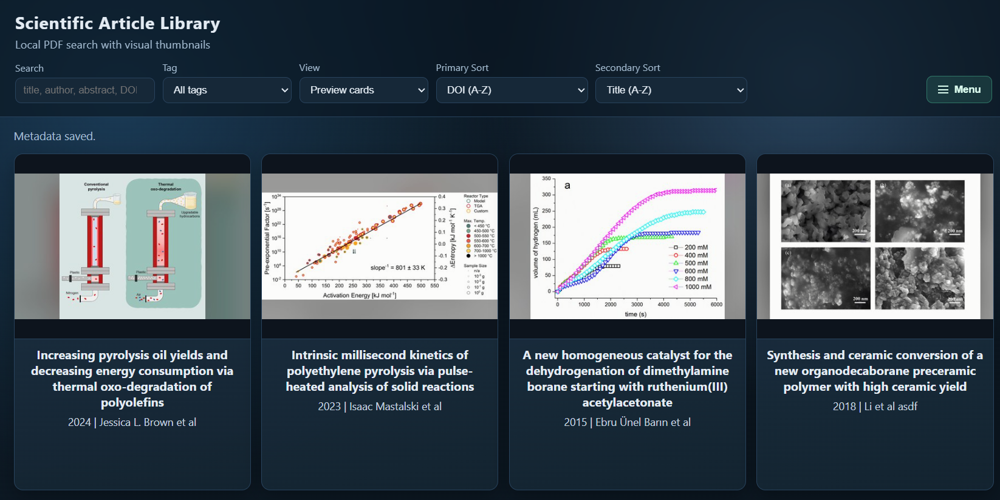

# Literature Library (Local Web UI)

Local, searchable article library for PDF collections with thumbnail cards, metadata editing, tags, and notes.



## Quick Start

1. Install dependencies:

```powershell
py -3 -m pip install -r requirements.txt
```

2. Start the app (from repo root):

```powershell
py -3 run_article_library.py
```

3. Open the URL printed by the CLI, for example:

```text
http://127.0.0.1:8080
```

If `8080` is blocked/reserved on Windows, the app now auto-picks a nearby fallback port and prints it.

## What This Implements

- Scans `Articles/` recursively for `.pdf` files.
- Extracts metadata from:
  - filename heuristic: `(<year>) <authors> - <title>.pdf`
  - PDF metadata and first-page DOI regex fallback.
- Generates auto thumbnails with configurable strategy:
  - `hybrid` (default): try embedded image, fallback to first-page render.
  - `embedded`: only embedded image extraction.
  - `first-page`: page render only.
  - previews are letterboxed (black bars) to preserve full image without crop/zoom.
- Stores generated index and assets in `library_data/`.
- Lets you correct metadata, add custom tags/notes, and upload manual thumbnail overrides.
- Includes two browsing modes: compact preview cards and a details-style list view.

## Data Layout

```text
Articles/                          # your source PDFs
library_data/
  index.json                       # generated catalog (merged view for UI/search)
  thumbnails/                      # auto-generated thumbnails
  manual_thumbnails/               # uploaded manual thumbnail overrides
  overrides/
    <article_id>.json              # human edits (metadata/tags/notes/manual mode)
web/
  index.html
  styles.css
  app.js
```

## Why This Structure

- `index.json` is fast for search and rendering.
- Per-article `overrides/<id>.json` avoids merge conflicts and protects manual edits from reindex.
- Separate `thumbnails/` and `manual_thumbnails/` lets you regenerate auto thumbs without touching manual overrides.

## Metadata Editing Model

- Auto extraction is non-destructive.
- Manual edits are stored only in override JSON.
- Reindexing rebuilds auto metadata and thumbnails, then re-applies overrides.
- You can toggle back to auto thumbnail mode at any time.

## Thumbnail Strategy Tradeoffs

1. Embedded image extraction
- Pros: often the cleanest visual figure from paper content.
- Cons: can pick logos/icons unless filtered; some PDFs have no extractable figure images.

2. First-page render
- Pros: always available, predictable.
- Cons: text-heavy preview, less visual.

3. Hybrid (recommended)
- Pros: best practical default for mixed scientific PDFs.
- Cons: still needs occasional manual overrides.

## CLI Options

```powershell
py -3 run_article_library.py --thumbnail-strategy hybrid
py -3 run_article_library.py --reindex-only
py -3 run_article_library.py --skip-reindex
py -3 run_article_library.py --host 0.0.0.0 --port 8080
py -3 run_article_library.py --port 5000 --no-port-fallback
```

## Notes for Larger Libraries

- Keep original PDFs in `Articles/` and avoid moving files after tagging to preserve stable IDs.
- For very large sets, keep using override files per article; this scales better than editing one giant hand-maintained JSON.
- If search eventually slows, move to server-side indexed search (SQLite FTS) while keeping the same override schema.
